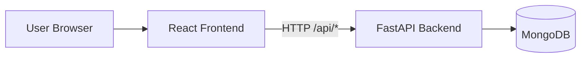
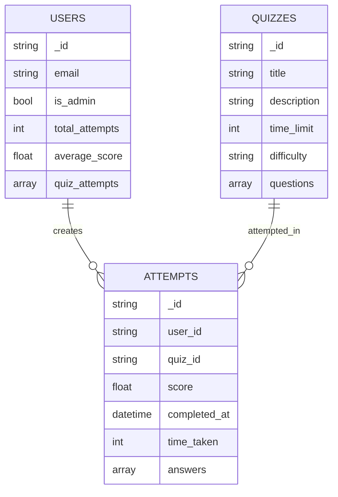

# FastAPI + React Quiz System Structure

This document maps how the backend and frontend are connected, and how data flows through the quiz system.

## 1) High-level Architecture

## 2) Backend Structure and Relationships

### App bootstrap

- `app/main.py`
  - Creates FastAPI app.
  - Connects MongoDB in lifespan startup and initializes indexes/migrations.
  - Registers all routers with base prefix `/api`.

### Database layer

- `app/db/connection.py`: creates and manages `db_manager.client` and `db_manager.db`.
- `app/db/database.py`: `get_db()` dependency used by route handlers.
- `app/db/init_db.py`:
  - Creates indexes for `users` and `attempts`.
  - Migrates existing user documents with default fields.

### Auth and dependencies

- `app/auth/jwt_handler.py`: password hashing + JWT access/refresh token logic.
- `app/auth/dependencies.py`:
  - `get_current_user` validates bearer access token.
  - `get_current_admin_user` enforces admin-only access.
  - Shared across users/attempt/admin routes.

### API route modules

- `app/routes/auth.py`:
  - `POST /api/auth/register`
  - `POST /api/auth/login`
  - `GET /api/auth/me`
  - `POST /api/auth/refresh`
  - `POST /api/auth/logout`
- `app/routes/change_password.py`:
  - `POST /api/auth/change-password`
- `app/routes/users.py`:
  - User profile/stats/dashboard endpoints under `/api/users/*`
- `app/routes/quizzes.py`:
  - `GET /api/quizzes/`
  - `GET /api/quizzes/{quiz_id}`
- `app/routes/questions.py`:
  - `GET /api/quizzes/{quiz_id}/questions/`
- `app/routes/attempts.py`:
  - `POST /api/quizzes/{quiz_id}/submit`
  - `GET /api/attempts/`
  - `GET /api/attempts/{attempt_id}`
- `app/routes/admin.py` (admin-protected):
  - User management: `/api/admin/users*`
  - Quiz management: `/api/admin/quizzes*`
  - Dashboard: `/api/admin/dashboard`

## 3) Data Model Relationships (MongoDB)

Collections used in practice:

- `users`
- `quizzes`
- `attempts`

Relationship view:

Practical relation keys:

- `attempts.user_id` -> `users._id` (stored as string value)
- `attempts.quiz_id` -> `quizzes._id` (stored as string value)
- `users.quiz_attempts` stores summary records per attempt.

## 4) Schema Layer Relationship

Pydantic API schemas in `app/schemas/` define payload contracts:

- `question.py`: `OptionBase`, `QuestionBase`
- `quiz.py`: `QuizCreate` contains `List[QuestionBase]`
- `attempt.py`: `AttemptCreate` contains `List[AnswerData]`
- `user.py`: `User`, `UserUpdate`, `UserStats`
- `auth.py`: `LoginRequest`, token request/response shapes

Notes:

- Route handlers return schema-shaped responses.
- `app/models/` contains domain models, but route responses mainly rely on `app/schemas/`.

## 5) Frontend Structure and Relationships

### Core wiring

- `frontend/src/main.jsx` wraps app with:
  - `BrowserRouter`
  - `AuthProvider`
- `frontend/src/App.jsx` defines routes and route guards:
  - Public routes (`/`, `/login`, `/register`)
  - Protected routes (`/quizzes`, `/quiz/:id`, `/attempts`, etc.)
  - Admin routes (`/admin/*`)

### Service layer

- `frontend/src/services/api.js`:
  - Axios instance with base URL `VITE_API_URL` or `http://localhost:8000/api`
  - Adds bearer token automatically.
  - On `401`, tries refresh flow then retries request.
- `frontend/src/services/authService.js`:
  - login/register/logout/token verification helpers.
- `frontend/src/services/quizService.js`:
  - quiz list/detail/questions, submit attempt, attempts, admin quiz actions.

### Route protection

- `frontend/src/components/ProtectedRoute.jsx`: requires authenticated user.
- `frontend/src/components/AdminRoute.jsx`: requires authenticated user with `is_admin=true`.

## 6) End-to-end Data Flow

### Login flow

1. React login page calls `authService.login()`.
2. Backend `/api/auth/login` validates user and returns access/refresh tokens.
3. Frontend stores tokens in localStorage.
4. Axios interceptor injects access token into future requests.

### Quiz attempt flow

1. User opens quiz details and starts quiz (`TakeQuiz.jsx`).
2. Frontend submits answers to `/api/quizzes/{quiz_id}/submit`.
3. Backend computes score from quiz question options.
4. Backend saves attempt in `attempts` and updates `users` stats.
5. Frontend navigates to results page with attempt id.

### Admin flow

1. Admin pages call `/api/admin/*` endpoints.
2. Backend dependency `get_current_admin_user` authorizes admin role.
3. Admin can manage users/quizzes and view dashboard metrics.

## 7) Frontend-Backend Endpoint Mapping

Implemented and aligned examples:

- `quizService.getAllQuizzes()` -> `GET /api/quizzes/`
- `quizService.getQuizById(id)` -> `GET /api/quizzes/{id}`
- `quizService.submitQuizAttempt(id, answers)` -> `POST /api/quizzes/{id}/submit`
- `ManageUsers.jsx` actions -> `/api/admin/users*`

Alignment status:

- Frontend and backend are now aligned for auth verification (`GET /api/auth/me`).
- Frontend and backend are now aligned for token refresh (`POST /api/auth/refresh`).
- Frontend and backend are now aligned for logout (`POST /api/auth/logout`).
- Frontend connection test now targets an existing `/api` endpoint (`GET /api/quizzes/`).

## 8) Quick Mental Model

- `app/routes/*` = HTTP behavior
- `app/auth/*` = auth + permissions
- `app/db/*` = DB connectivity + initialization
- `app/schemas/*` = API contracts
- `frontend/src/pages/*` = screens
- `frontend/src/services/*` = API calls
- `frontend/src/contexts/AuthContext.jsx` = auth session state in React
